# StoreRate - Store Rating Platform

[](https://react.dev/)
[](https://vitejs.dev/)
[](https://nodejs.org/)
[](https://expressjs.com/)
[](https://www.mongodb.com/)
[](https://jwt.io/)

A full-stack store discovery and rating platform that enables customers to search and rate local stores, store owners to monitor customer feedback analytics, and administrators to oversee platform users, store directories, and platform statistics.

---

## 📖 Table of Contents

- [Project Overview](#-project-overview)
- [Features](#-features)
- [User Roles](#-user-roles)
- [Tech Stack](#-tech-stack)
- [Application Screenshots](#-application-screenshots)
- [Demo Login Credentials](#-demo-login-credentials)
- [Project Structure](#-project-structure)
- [Backend API Overview](#-backend-api-overview)
- [Authentication Flow](#-authentication-flow)
- [Database Structure](#-database-structure)
- [Validation Rules](#-validation-rules)
- [Installation](#-installation)
- [Environment Variables](#-environment-variables)
- [Running the Project](#-running-the-project)
- [Build for Production](#-build-for-production)
- [Deployment](#-deployment)
- [GitHub Repository](#-github-repository)
- [Future Improvements](#-future-improvements)

---

## 📌 Project Overview

**StoreRate** is an end-to-end full-stack web application designed to connect local customers and store owners:

- **Normal Users (Customers)** can:
  - Register an account and securely log in.
  - Browse all registered stores with real-time search by Store Name and Address.
  - Sort stores by Name, Address, or Overall Average Rating.
  - View overall store ratings and see their own submitted score (`myRating`).
  - Submit ratings between 1 and 5 stars with instant UI feedback.
  - Modify or update their existing rating anytime.
- **System Administrators** can:
  - View high-level platform statistics (Total Users, Total Stores, Total Ratings).
  - Manage users with multi-field search (Name, Email, Address) and role filtering.
  - Create new users directly with designated roles (`admin`, `user`, `owner`).
  - View comprehensive user details, including linked store and review statistics for store owners.
  - Manage all stores and create new stores assigned to registered store owners.
- **Store Owners** can:
  - Log in to a dedicated business dashboard.
  - Monitor their store's profile, real-time average star rating, and total customer reviews count.
  - Access a detailed customer review feed showing customer names, emails, star scores, and review dates with multi-column sorting.
- **Security & Authorization**:
  - Secure JSON Web Token (JWT) authentication.
  - Role-Based Access Control (RBAC) enforced across both frontend routes and backend controllers.
  - Passwords securely hashed with `bcryptjs` (10 salt rounds).

---

## ✨ Features

- **Responsive Modern UI**: Built with pure CSS, Flexbox, and CSS Grid. Includes a collapsible sidebar drawer for mobile devices.
- **Interactive Rating System**: 1–5 star rating selector that dynamically switches between "Submit Rating" and "Update Rating".
- **Real-Time Data Filtering & Sorting**: Server-side filtering and sorting for stores and customer management tables.
- **Strict Role-Based Routing**: Protected routes prevent unauthorized access; automatic redirects on `401 Unauthorized` or `403 Forbidden` statuses.
- **Unified Password Management**: Reusable password change interface across all three user roles.
- **Complete Seed Script**: Idempotent automated database seeder for instant setup and testing.

---

## 👥 User Roles

| Role | Permissions |
|---|---|
| **Admin** | Access admin dashboard statistics; view, search, filter, and sort all users and stores; create users; create stores; view user profiles. |
| **Normal User** | Browse store directory; search stores by name and address; sort stores; submit and update personal store ratings (1–5 stars); change password. |
| **Store Owner** | View store profile, overall average rating, and total review counts; view customer ratings table with sorting; change password. |

---

## 💻 Tech Stack

### Frontend
- **Framework**: [React.js 19](https://react.dev/) + [Vite](https://vitejs.dev/)
- **Routing**: [React Router DOM v7](https://reactrouter.com/)
- **HTTP Client**: [Axios](https://axios-http.com/) (configured with JWT request and response interceptors)
- **Styling**: Pure CSS (CSS variables, Flexbox, CSS Grid, responsive media queries)

### Backend
- **Runtime**: [Node.js](https://nodejs.org/) (ES Modules)
- **Framework**: [Express.js 5](https://expressjs.com/)
- **Authentication**: [jsonwebtoken (JWT)](https://jwt.io/)
- **Password Hashing**: [bcryptjs](https://www.npmjs.com/package/bcryptjs)
- **CORS Handling**: [cors](https://www.npmjs.com/package/cors)
- **Configuration**: [dotenv](https://www.npmjs.com/package/dotenv)

### Database
- **Database**: [MongoDB](https://www.mongodb.com/) (Atlas or local Community Edition)
- **ODM**: [Mongoose 9](https://mongoosejs.com/)

---

## 📸 Application Screenshots

### 1. Authentication
| Login Page | Registration Page |
|:---:|:---:|
| 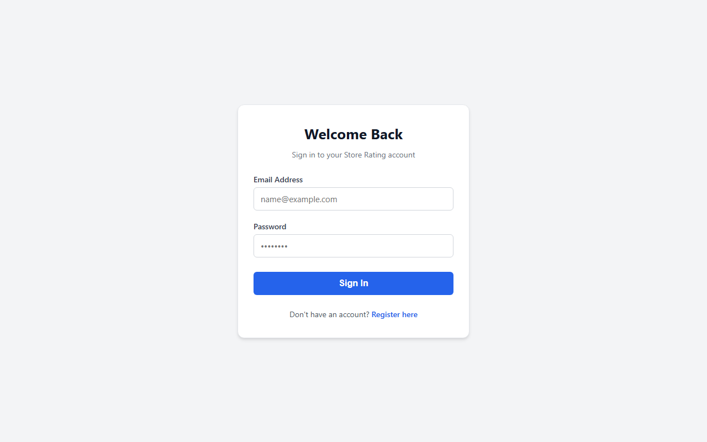 | 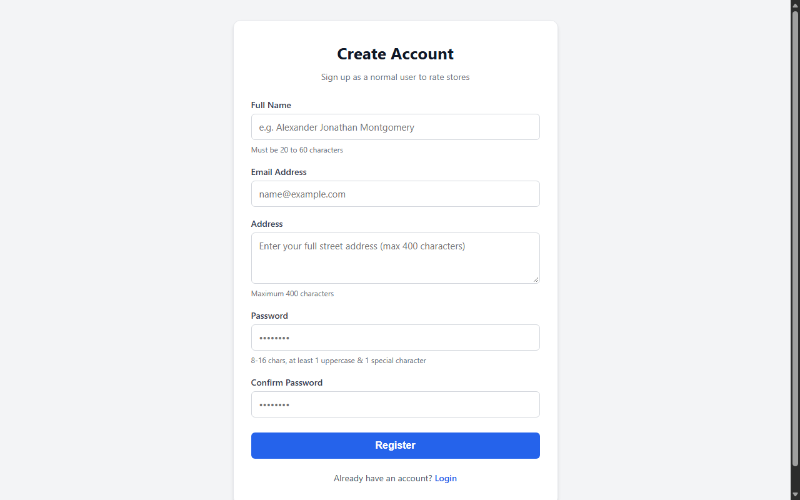 |

---

### 2. Normal User Experience
| User Dashboard | Store Directory & Rating |
|:---:|:---:|
| 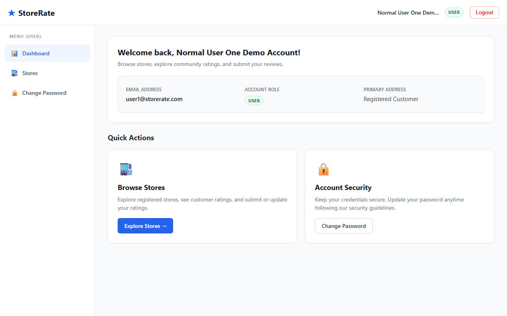 | 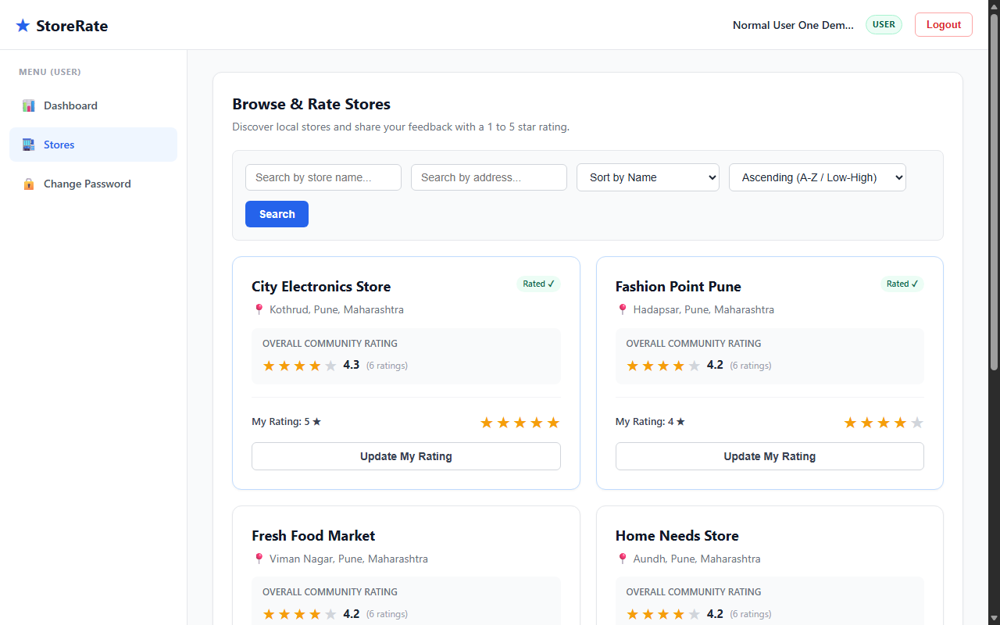 |

---

### 3. Administrator Portal
| Admin Dashboard | User Management Directory |
|:---:|:---:|
| 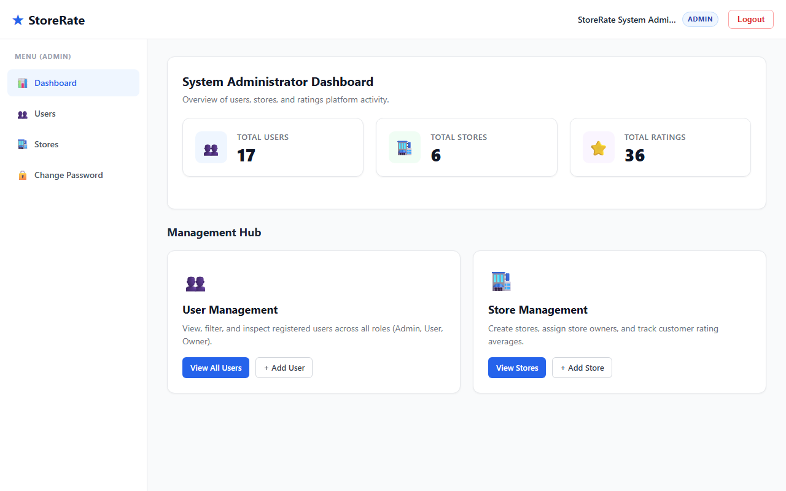 | 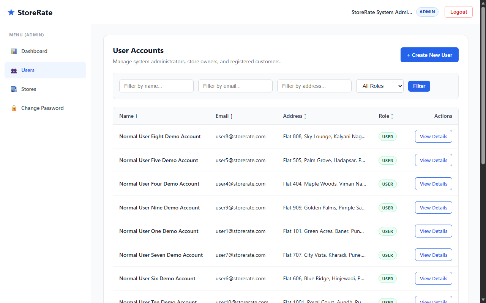 |

| Create New User | User Profile Details (with Store) |
|:---:|:---:|
| 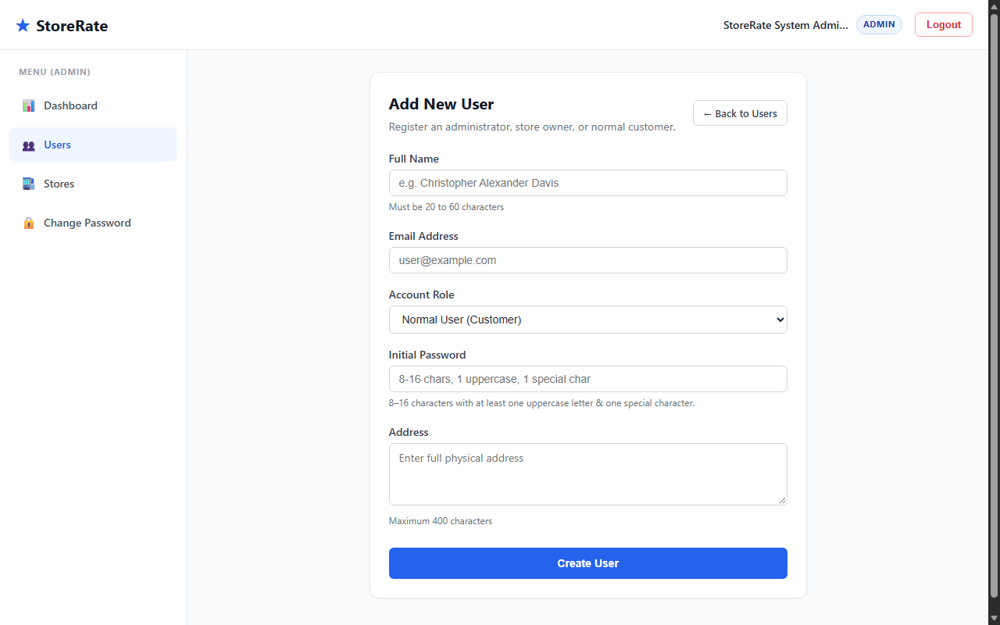 | 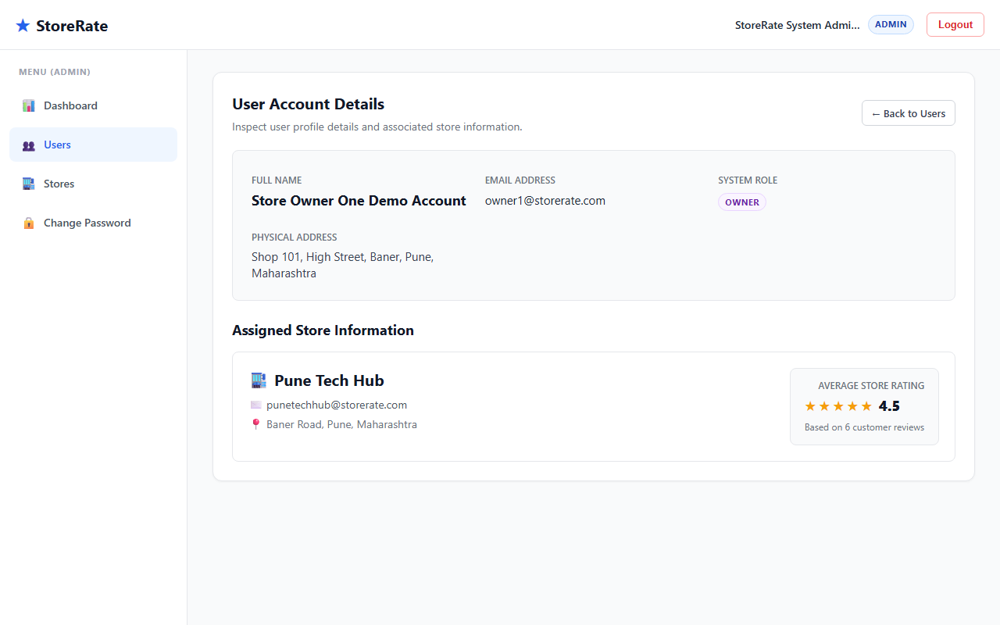 |

| Store Directory Management | Create New Store |
|:---:|:---:|
| 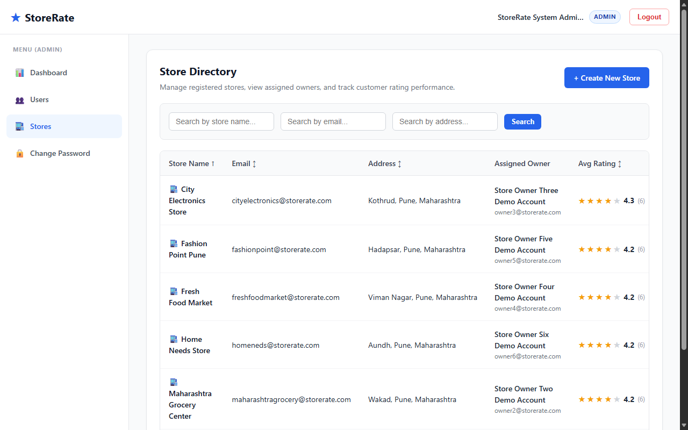 | 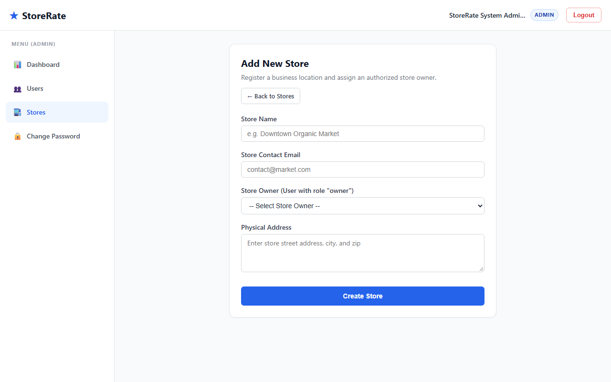 |

---

### 4. Store Owner Dashboard
| Owner Dashboard | Customer Ratings & Reviews |
|:---:|:---:|
| 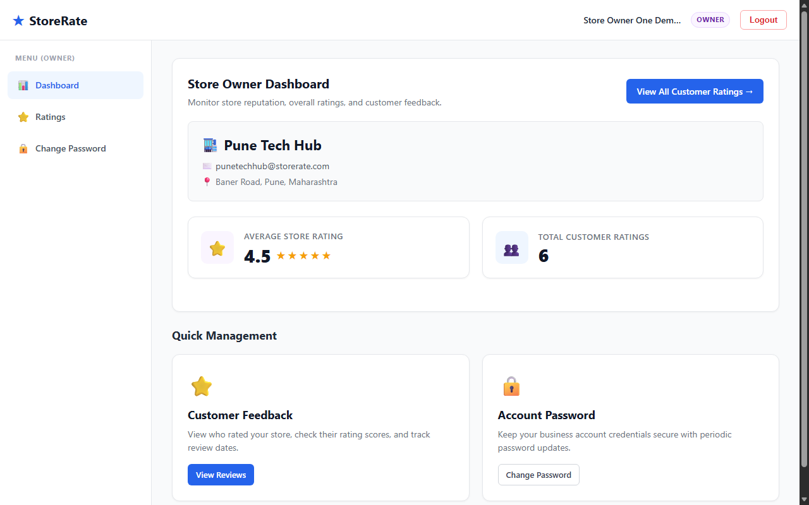 | 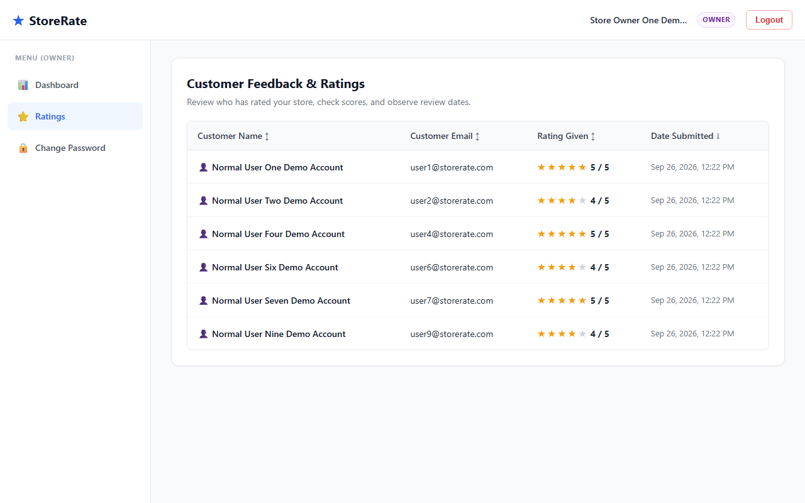 |

---

## 🔑 Demo Login Credentials

> ⚠️ **Notice:** These credentials are for local demo and evaluation purposes only.

### 👑 Administrator Account
- **Email:** `admin@storerate.com`
- **Password:** `Admin123!`
- **Role:** `admin`

### 🏪 Store Owner Accounts *(Password for all: `Owner123!`)*
1. `owner1@storerate.com` &rarr; Store: **Pune Tech Hub**
2. `owner2@storerate.com` &rarr; Store: **Maharashtra Grocery Center**
3. `owner3@storerate.com` &rarr; Store: **City Electronics Store**
4. `owner4@storerate.com` &rarr; Store: **Fresh Food Market**
5. `owner5@storerate.com` &rarr; Store: **Fashion Point Pune**
6. `owner6@storerate.com` &rarr; Store: **Home Needs Store**

### 👤 Normal User Accounts *(Password for all: `User123!`)*
1. `user1@storerate.com`
2. `user2@storerate.com`
3. `user3@storerate.com`
4. `user4@storerate.com`
5. `user5@storerate.com`
6. `user6@storerate.com`
7. `user7@storerate.com`
8. `user8@storerate.com`
9. `user9@storerate.com`
10. `user10@storerate.com`

---

## 📁 Project Structure

```text
StoreRate/
├── backend/
│   ├── seed.js                       # Database seeding script (creates demo data)
│   ├── server.js                     # Express application entry point
│   ├── package.json
│   ├── .env.example                  # Backend environment variable template
│   └── src/
│       ├── config/
│       │   └── db.js                 # Mongoose database connection setup
│       ├── Controllers/
│       │   ├── adminController.js    # Administrator business logic
│       │   ├── authController.js     # User registration and login logic
│       │   ├── ownerController.js    # Store owner dashboard and ratings logic
│       │   ├── ratingController.js   # Customer rating submission logic
│       │   ├── storeController.js    # Store discovery and filtering logic
│       │   └── userController.js     # Password update logic
│       ├── middlewares/
│       │   └── authMiddleware.js     # JWT verification and role authorization
│       ├── models/
│       │   ├── Rating.js             # Rating Mongoose schema
│       │   ├── Store.js              # Store Mongoose schema
│       │   └── User.js               # User Mongoose schema
│       └── routes/
│           ├── adminRoutes.js        # /api/admin routes
│           ├── authRoute.js          # /api/auth routes
│           ├── ownerRoutes.js        # /api/owner routes
│           ├── ratingRoutes.js       # /api/ratings routes
│           ├── storeRoutes.js        # /api/stores routes
│           └── userRoutes.js         # /api/users routes
│
├── frontend/
│   ├── index.html                    # Single page application HTML shell
│   ├── vite.config.js
│   ├── package.json
│   ├── .env.example                  # Frontend environment variable template
│   └── src/
│       ├── App.jsx                   # Central route registry & layout binding
│       ├── main.jsx                  # React DOM root entry
│       ├── index.css                 # Base resets and typography tokens
│       ├── components/
│       │   ├── ProtectedRoute.jsx    # Authentication route guard
│       │   ├── RoleRoute.jsx         # Role authorization route guard
│       │   ├── common/
│       │   │   ├── Common.css        # Card, table, filter, badge design system
│       │   │   ├── ErrorMessage.jsx  # Standard error container
│       │   │   ├── Loading.jsx       # Universal loading spinner
│       │   │   ├── RatingStars.jsx   # Interactive 1–5 star rating selector
│       │   │   └── SuccessMessage.jsx# Dismissible success alert
│       │   └── layout/
│       │       ├── MainLayout.jsx    # Responsive layout container
│       │       ├── MainLayout.css    # Sidebar and navigation styles
│       │       ├── Navbar.jsx        # Top header with profile & logout
│       │       └── Sidebar.jsx       # Dynamic role-specific navigation menu
│       ├── context/
│       │   └── AuthContext.jsx       # Authentication state & localStorage sync
│       ├── pages/
│       │   ├── Login.jsx             # Public login view
│       │   ├── Register.jsx          # Public registration view
│       │   ├── Unauthorized.jsx      # 403 Forbidden screen
│       │   ├── admin/
│       │   │   ├── AdminCreateStore.jsx
│       │   │   ├── AdminCreateUser.jsx
│       │   │   ├── AdminDashboard.jsx
│       │   │   ├── AdminStores.jsx
│       │   │   ├── AdminUserDetails.jsx
│       │   │   └── AdminUsers.jsx
│       │   ├── common/
│       │   │   └── ChangePassword.jsx# Shared password modification view
│       │   ├── owner/
│       │   │   ├── OwnerDashboard.jsx
│       │   │   └── OwnerRatings.jsx
│       │   └── user/
│       │       ├── UserDashboard.jsx
│       │       └── UserStores.jsx
│       └── services/
│           └── api.js                # Axios instance with auto JWT attachment
│
├── docs/
│   └── screenshots/                  # High-resolution application screenshots
└── README.md
```

---

## 🔌 Backend API Overview

### Authentication Routes (`/api/auth`)
| Method | Endpoint | Access | Description |
|---|---|---|---|
| `POST` | `/api/auth/register` | Public | Register a normal user account |
| `POST` | `/api/auth/login` | Public | Authenticate credentials and receive JWT |

### User Routes (`/api/users`)
| Method | Endpoint | Access | Description |
|---|---|---|---|
| `PUT` | `/api/users/update-password` | Authenticated | Change current user password |

### Store Routes (`/api/stores`)
| Method | Endpoint | Access | Description |
|---|---|---|---|
| `GET` | `/api/stores` | Authenticated | Get all stores (includes `myRating` for current user; supports search & sort) |

### Rating Routes (`/api/ratings`)
| Method | Endpoint | Access | Description |
|---|---|---|---|
| `POST` | `/api/ratings` | Normal User | Submit or update store rating (1–5 stars) |

### Administrator Routes (`/api/admin`)
| Method | Endpoint | Access | Description |
|---|---|---|---|
| `GET` | `/api/admin/dashboard` | Admin | Get metrics: Total Users, Total Stores, Total Ratings |
| `GET` | `/api/admin/users` | Admin | Get user list with filtering (`name`, `email`, `address`, `role`) and sorting |
| `POST` | `/api/admin/users` | Admin | Create a new user with role (`admin`, `user`, `owner`) |
| `GET` | `/api/admin/users/:id` | Admin | Get user details (includes store & rating info if owner) |
| `GET` | `/api/admin/stores` | Admin | Get all stores with owner information and average ratings |
| `POST` | `/api/admin/stores` | Admin | Create a new store assigned to a store owner |

### Store Owner Routes (`/api/owner`)
| Method | Endpoint | Access | Description |
|---|---|---|---|
| `GET` | `/api/owner/dashboard` | Owner | Get owner's store information, average rating, and total rating count |
| `GET` | `/api/owner/ratings` | Owner | Get customer ratings list for owner's store with sorting |

---

## 🔒 Authentication Flow

```text
  [ User ]
     │
     ▼ (1) POST /api/auth/login (email, password)
[ Backend ]
     │
     ├── (2) Verify email exists in MongoDB
     ├── (3) Compare password hash with bcrypt.compare()
     └── (4) Sign JWT payload: { id: user._id, role: user.role }
     │
     ▼ (5) Return { token, user: { id, name, email, role } }
[ Frontend ]
     │
     ├── (6) Save token in localStorage["token"]
     ├── (7) Save user in localStorage["user"]
     └── (8) Sync into AuthContext React state
     │
     ▼ (9) All subsequent requests through Axios instance (api.js)
           automatically append: Authorization: Bearer <token>
     │
[ Backend Middleware ]
     │
     ├── authenticateUser: Decodes JWT and attaches req.user
     └── authorizeRoles: Verifies user role (admin | user | owner)
```

- **Password Security**: Passwords are never stored in plain text. Hashed with `bcryptjs` using 10 salt rounds.
- **Session Expiration / 401 Handling**: When a token expires or is invalid, the Axios response interceptor removes local tokens and redirects to `/login`.
- **403 Forbidden Handling**: Accessing routes unauthorized for the user's role redirects to `/unauthorized`.

---

## 🗄️ Database Structure

### 1. `User` Schema
- `name`: String, required, 20–60 characters.
- `email`: String, required, unique, lowercase.
- `password`: String, required (stored as bcrypt hash).
- `address`: String, required, max 400 characters.
- `role`: String, enum: `["admin", "user", "owner"]`, default: `"user"`.

### 2. `Store` Schema
- `name`: String, required, trimmed.
- `email`: String, required, lowercase.
- `address`: String, required, max 400 characters.
- `owner`: ObjectId referencing `User` (role must be `owner`), required.

### 3. `Rating` Schema
- `user`: ObjectId referencing `User` (normal customer), required.
- `store`: ObjectId referencing `Store`, required.
- `rating`: Number, required, minimum 1, maximum 5.

```text
┌─────────────────┐             1:1             ┌─────────────────┐
│      User       │ ──────────────────────────> │      Store      │
│  (role: owner)  │                             │  (owner: user)  │
└─────────────────┘                             └─────────────────┘
                                                         │
                                                         │ 1:N
┌─────────────────┐             1:N                      ▼
│      User       │ ──────────────────────────> ┌─────────────────┐
│  (role: user)   │                             │     Rating      │
└─────────────────┘                             │  (user, store)  │
                                                └─────────────────┘
```

> **Unique Compound Index**:
> ```javascript
> ratingSchema.index({ user: 1, store: 1 }, { unique: true });
> ```
> Ensures that a user can never submit duplicate ratings for the same store. Subsequent submissions modify the existing rating.

---

## 📏 Validation Rules

Frontend and backend validation rules are synchronized:

| Field | Rule | Description |
|---|---|---|
| **Name** | `20 - 60 chars` | Must be between 20 and 60 characters long. |
| **Address** | `max 400 chars` | Physical address must not exceed 400 characters. |
| **Password** | `8 - 16 chars` | Must contain at least one uppercase letter (`A-Z`) and at least one special character (`!@#$%^&*` etc.). |
| **Email** | `RFC standard` | Must be a valid email format, unique across users. |
| **Rating** | `1 - 5 integer` | Integer score between 1 and 5 stars. |

---

## ⚙️ Installation

### 1. Clone the Repository
```bash
git clone https://github.com/tejasvairal1234/StoreRate.git
cd StoreRate
```

### 2. Install Backend Dependencies
```bash
cd backend
npm install
```

### 3. Install Frontend Dependencies
```bash
cd ../frontend
npm install
```

---

## 🔑 Environment Variables

### Backend Configuration (`backend/.env`)
Create a `.env` file in the `backend/` folder:

```ini
PORT=5000
MONGODB_URI=your_mongodb_connection_string
JWT_SECRET=your_jwt_secret_key
```

*(A template is available at `backend/.env.example`).*

### Frontend Configuration (`frontend/.env`)
Create a `.env` file in the `frontend/` folder:

```ini
VITE_API_URL=http://localhost:5000/api
```

*(A template is available at `frontend/.env.example`).*

> **Security Note:** All `.env` files are excluded from version control via `.gitignore`. Never commit API keys or production secrets to Git.

---

## 🚀 Running the Project

### Step 1: Seed the Database (Optional but Recommended)
Populate your database with demo users, stores, and realistic ratings:

```bash
cd backend
npm run seed
```

### Step 2: Start the Backend Server
```bash
cd backend
npm run dev
```
Backend API will start at: `http://localhost:5000`

### Step 3: Start the Frontend Client
In a new terminal window:
```bash
cd frontend
npm run dev
```
Frontend application will be available at: `http://localhost:5173`

---

## 📦 Build for Production

To create an optimized production build of the frontend:

```bash
cd frontend
npm run build
```

This compiles optimized HTML, CSS, and JS bundles into the `frontend/dist/` directory.

To preview the production build locally:
```bash
npm run preview
```

---

## 🌐 Deployment

### Frontend Deployment (Vercel / Netlify)
1. Push the repository to GitHub.
2. Import the project into **Vercel** or **Netlify**.
3. Set the **Root Directory** to `frontend`.
4. Configure the environment variable:
   - `VITE_API_URL`: Your deployed backend URL (e.g., `https://api.yourdomain.com/api`).
5. Build Command: `npm run build`
6. Output Directory: `dist`

### Backend Deployment (Render / Railway / Fly.io)
1. Set the **Root Directory** to `backend`.
2. Set Environment Variables:
   - `PORT`: `5000`
   - `MONGODB_URI`: Your MongoDB Atlas connection URI.
   - `JWT_SECRET`: A strong, randomly generated secret.
3. Build Command: `npm install`
4. Start Command: `node server.js`

### Database (MongoDB Atlas)
1. Create a free cluster on [MongoDB Atlas](https://www.mongodb.com/cloud/atlas).
2. Create a database user and whitelist your deployment IP addresses (`0.0.0.0/0` for cloud hosting).
3. Copy the connection string and supply it as `MONGODB_URI`.

---

## 🔗 GitHub Repository

- **Repository**: [https://github.com/tejasvairal1234/StoreRate.git](https://github.com/tejasvairal1234/StoreRate.git)
- **Primary Branch**: `main`

---

## 🔮 Future Improvements

- [ ] **Image Uploads**: Store logo and storefront photo uploads via Cloudinary / AWS S3.
- [ ] **Written Reviews**: Optional text feedback alongside 1–5 star ratings.
- [ ] **Password Reset**: Forgot password flow with secure email OTP / reset link.
- [ ] **Pagination**: Server-side pagination for large store catalogs and user tables.
- [ ] **Geolocation**: Filter stores by distance / radius using browser location.
